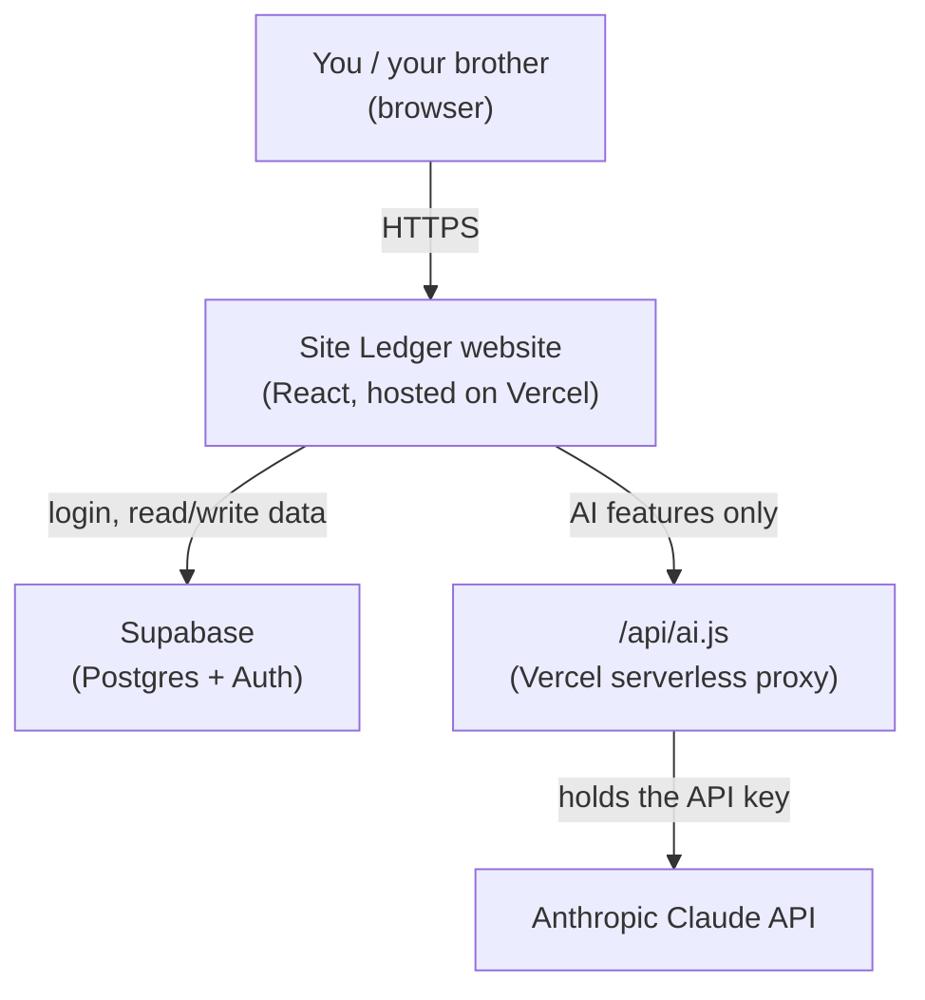

# Architecture — how Site Ledger actually works

This is the "explain it to someone else" document. Read this alongside
`README.md` (which is about *setting up* the pieces) — this one is about
*how the pieces work together* and *exactly where every piece of data
lives*.

## The three systems this app is built from

Site Ledger isn't one program — it's three separate services wired
together, each doing one job:

1. **The website itself** (this codebase) — runs in the browser, built
   with React + Vite, hosted on **Vercel**. It has no database of its
   own — every piece of data it shows came from somewhere else.
2. **Supabase** — the actual database, plus login/accounts (Supabase
   Auth). This is where every progress entry, expense, contact, and
   photo actually lives.
3. **Anthropic's Claude API** — called only for the three AI features
   (photo review, price checking, plan cross-check). Nothing else in
   the app touches it.



The `/api/ai.js` file exists purely so the Anthropic API key never has
to sit in browser code (anyone could open dev tools and steal it if it
did) — it's a thin pass-through, not a real "backend" in the usual sense.

## File-by-file map

```
src/
  main.jsx          — the actual entry point; just renders <AuthGate/>
  AuthGate.jsx       — everything about WHO you are: login, signup,
                       creating/joining a project, switching projects.
                       Only once this resolves does it render <App/>.
  App.jsx            — everything about WHAT you see once logged in:
                       all 11 tabs (Dashboard, Progress, Gallery, Budget,
                       Permissions, People, Products, Documents, Issues,
                       Team, Audit Log) live in this one file.
  lib/
    supabaseClient.js — the one place the Supabase connection is created.
    activeProject.js  — a tiny in-memory "which project am I looking at
                        right now" value, read by storage.js and audit.js
                        so they don't need it passed through every call.
    storage.js        — loadKey/saveKey: the ONLY two functions that
                        talk to your actual app data (kv_store table).
    audit.js          — logAudit: writes one row per action to the
                        audit_log table.
    roles.js           — the list of roles, which tabs each role can see,
                        and the project-type dropdown options.
api/
  ai.js              — the serverless function that holds the real
                       Anthropic API key and forwards AI requests to it.
supabase/
  schema.sql         — the actual database structure (see below).
```

## Where every piece of data lives (Supabase tables)

| Table | Holds | Written by |
|---|---|---|
| `profiles` | Your name + email (one row per person, across all projects) | Sign-up screen |
| `projects` | Project name, place, type, invite code | "Create a project" screen |
| `project_members` | Who belongs to which project, and their role there | Creating/joining a project; the Team tab (role changes) |
| `kv_store` | **Everything you log in the app** — progress, expenses, contacts, permissions, products, documents, issues, gallery photos, the budget number, the building plan text, which stages are marked complete | Every "Add entry" button, every edit, anywhere in the app |
| `audit_log` | One row per login, logout, signup, project join, role change, and data save | Automatically, in the background |

**The `kv_store` table is the one to understand well** — it's not one
row per expense or one row per contact. It's one row **per tab's worth
of data**: one row holds your *entire* expenses list as a single block
of data (technically: JSON), another row holds your *entire* contacts
list, and so on. Concretely:

| `key` column value | What's inside that row's `value` |
|---|---|
| `meta` | project name override, budget allocated, building plan text, which stages are marked complete |
| `progress` | every daily progress log entry |
| `expenses` | every expense |
| `permissions` | every permission/approval entry |
| `contacts` | every person's name/phone/role |
| `products` | every product logged |
| `documents` | every bill/agreement entry |
| `issues` | every hiccup + resolution |
| `gallery` | every photo (as base64 image data) + its AI notes |
| `loan` | loan sanctioned/disbursed amounts + entries |

Every one of those rows also has a `project_id` — so if you're on two
different house projects, there are two completely separate `progress`
rows (one per project), and the app only ever loads the one for
whichever project is currently active.

## Walking through a real action: "I log a new expense"

1. You click **Add expense**, fill the form, click **Save**.
2. In `App.jsx`, this calls `saveKey("expenses", <the new full list>)`.
3. `storage.js` grabs the currently active project's ID (from
   `activeProject.js`) and does one `upsert` into `kv_store`, in the
   row where `project_id` = your project and `key` = `"expenses"`.
4. Right after that succeeds, `storage.js` also calls `logAudit`, which
   inserts one row into `audit_log` recording that you (your user ID,
   your email) saved something under the key `"expenses"`, with a
   timestamp.
5. Nothing is pushed to other devices in real time — your brother would
   see the new expense the next time *his* browser loads (or reloads)
   that project's data. There's no live-sync/websocket in this version.

## Walking through login → dashboard

1. You enter email/password → Supabase Auth checks it, returns a
   session token (handled entirely by the `@supabase/supabase-js`
   library — the app never sees your password itself).
2. `AuthGate.jsx` looks up your `profiles` row (for your name) and all
   your `project_members` rows (which project(s) you're on, and your
   role on each).
3. If you're on exactly one project, it's selected automatically. If
   more than one, you see the picker. If none yet, you see the
   create/join screen.
4. Once a project is chosen, `activeProject.js`'s value is set, and
   `<App/>` mounts — which immediately calls `loadKey` for every one of
   the ten keys in the table above, in parallel, and only then shows
   the dashboard.

## Roles: what actually gates what

`src/lib/roles.js` has one exported list, `ROLE_TAB_ACCESS`, mapping
each role to which tab keys it can see. `App.jsx` filters the nav bar
using that list, and separately double-checks it before actually
rendering each tab's content (`canSee(tabKey)`), so a role never briefly
flashes a tab it shouldn't see.

**Important limitation, worth remembering:** this is enforced in the
*app's UI code only*. The database's actual permission rules (Row Level
Security policies in `schema.sql`) currently allow **any** project
member to read/write **all** of that project's `kv_store` data,
regardless of role. So today, a carpenter's account genuinely *could*
fetch budget data by calling Supabase directly instead of clicking
through the app — the tab hiding just makes it inconvenient, not
impossible. Fine for a small trusted team; would need real per-role
database policies before this became a product for strangers.

## The AI features specifically

All three (photo review in Gallery, price check in Products, plan
cross-check in Progress) go through the exact same path:

`App.jsx` calls `askClaude({ text, images, useSearch })` → this posts to
`/api/ai` (your own Vercel serverless function) → `api/ai.js` attaches
your real Anthropic API key (from Vercel's environment variables, never
visible to the browser) → calls Claude → returns just the text back to
the browser.

None of these three features write anything to the database by
themselves — the *result* only gets saved if you click "Save" after
reviewing it (e.g. saving a gallery photo with its AI note attached).
